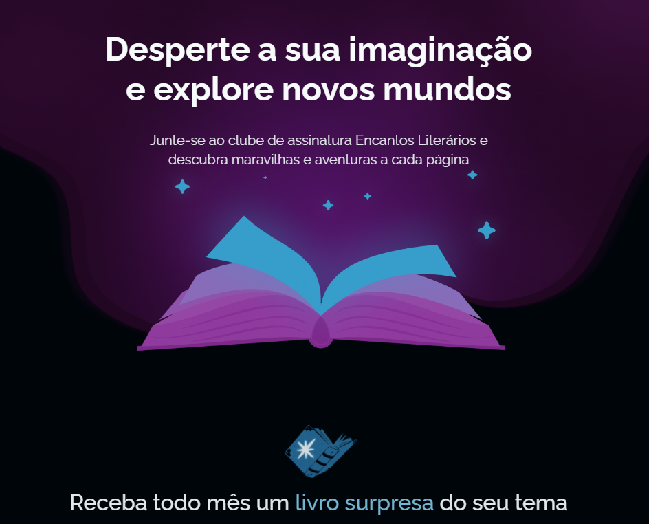

# Encantos Literários



## 📌 Menu de Navegação

- [Sobre o Projeto](#-sobre-o-projeto)
- [Layout](#-layout)
- [Tecnologias, Bibliotecas e Ferramentas](#-tecnologias-bibliotecas-e-ferramentas-utilizadas)
- [Como Rodar](#-como-rodar)
- [Como Visualizar o Projeto](#-como-visualizar-o-projeto)
- [Licença](#-licença)

---

## 📖 Sobre o Projeto

O **Encantos Literários** é um projeto desenvolvido como parte de um desafio prático da **Rocketseat**, focado no domínio de **animações CSS e transições fluidas**. O objetivo principal é criar uma interface de catálogo de livros onde a experiência do usuário é elevada através de microinterações, efeitos de _hover_, e carregamentos dinâmicos que tornam a navegação mais orgânica e charmosa.

---

## 🎨 Layout

O layout foi desenhado para simular uma estante virtual moderna. Os principais destaques de design incluem:

- **Cards Animados:** Efeitos de profundidade e escala ao interagir com as capas.
- **Transições de Estado:** Mudanças suaves entre visualizações de detalhes.
- **Responsividade:** Adaptação completa para diferentes tamanhos de tela, mantendo a harmonia visual das animações.

---

## 🛠 Tecnologias, Bibliotecas e Ferramentas Utilizadas

As seguintes ferramentas foram fundamentais para a execução deste desafio:

- **HTML5**: Estruturação semântica do catálogo.
- **CSS3 (Advanced Animations)**: Utilização de `@keyframes`, `transitions`, `transform` e `filter` para os efeitos visuais.
- **Google Fonts**: Tipografia selecionada para reforçar a estética literária.
- **Git/GitHub**: Versionamento e publicação.

---

## 🚀 Como Rodar

Para testar o projeto localmente, siga estes passos:

1.  **Clone o repositório:**

    ```bash
    git clone [https://github.com/willianpm/encantos-literarios.git](https://github.com/willianpm/encantos-literarios.git)
    ```

2.  **Entre no diretório:**

    ```bash
    cd encantos-literarios
    ```

3.  **Execução:**
    Como o projeto é composto por arquivos estáticos, basta abrir o arquivo `index.html` diretamente no seu navegador ou utilizar o **Live Server** no VS Code para uma melhor experiência de desenvolvimento.

---

## 👁️ Como Visualizar o Projeto

Você pode conferir o resultado final de duas maneiras:

1.  **Localmente:** Através dos passos descritos acima.
2.  **Deploy:** Acesse a versão online através do link disponível no "About" deste repositório no GitHub (geralmente via GitHub Pages ou Vercel).

---

## 📄 Licença

Este projeto é de código aberto e está licenciado sob a **MIT License**.

---

_Desafio prático concluído com foco em UX/UI e Animações._
